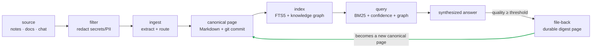
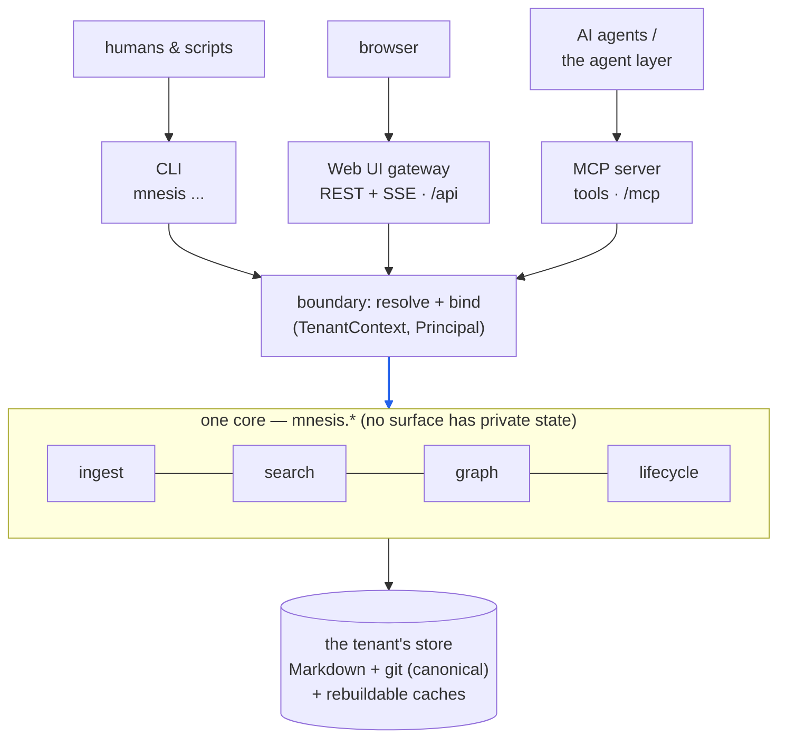
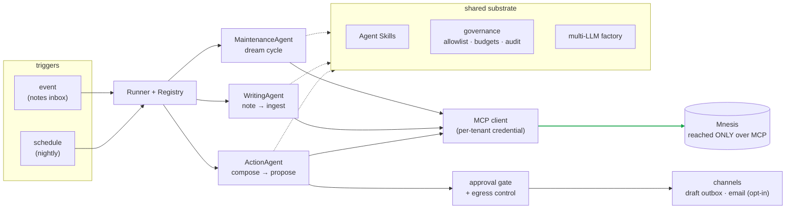
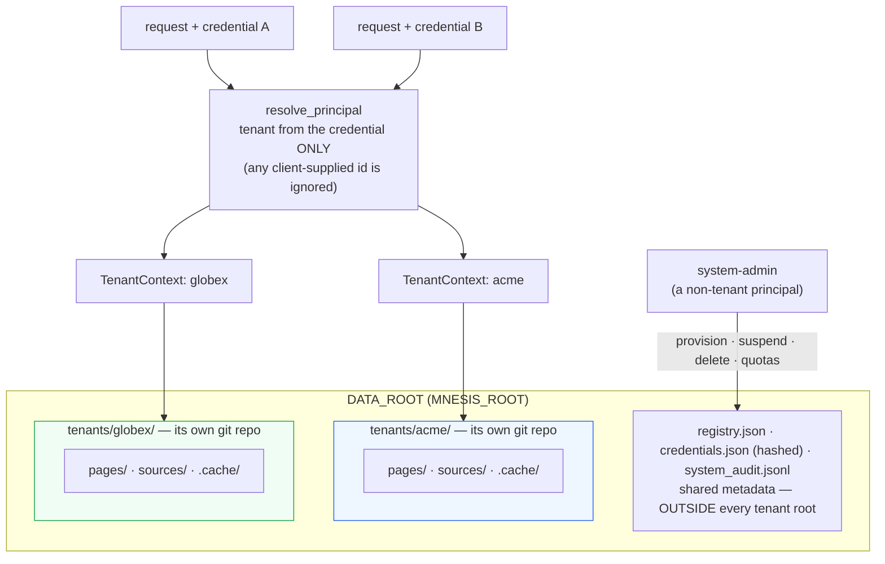

# mnesis

**A knowledge base that compounds instead of resetting.**

Retrieval-augmented generation fetches context and forgets it. mnesis does the
opposite: every source you feed it is filtered, distilled into a canonical page,
and woven into a growing, self-reinforcing memory. Synthesized answers are filed
back as durable knowledge, so the system gets *more* useful the more it is used —
the compounding loop:

> **filter → ingest → write a canonical page → index → query → file an answer back → query again and see it surface.**



The green edge is the **compounding step**: a synthesized answer that clears the
quality gate is written back as a durable page, so asking again later *surfaces it
as knowledge* instead of re-deriving it. RAG fetches and forgets; mnesis accumulates
— the knowledge base grows more useful each time it is used.

mnesis is built to be the long-term memory for AI agents (reachable over the
[Model Context Protocol](https://modelcontextprotocol.io)) while remaining fully
usable by humans through a CLI and a web UI. The authoritative design contract is
[`CLAUDE.md`](CLAUDE.md) — when this README and that document disagree, `CLAUDE.md`
is the intended design.

---

## Table of contents

- [What you get](#what-you-get)
- [How it works](#how-it-works) — the mental model
- [Quickstart](#quickstart)
- [Using the CLI](#using-the-cli)
- [The three surfaces](#the-three-surfaces) — CLI · MCP · Web UI
- [The agent layer](#the-langgraph-agent-foundation) — multi-LLM agents: the maintenance **dream cycle**, the notes-inbox **writing agent**, and the approval-gated **action agent**
- [Multitenancy](#multitenancy) — isolation by construction, the admin boundary, quotas
- [Running with Docker](#running-with-docker)
- [Making the most of mnesis](#making-the-most-of-mnesis) — best practices
- [Configuration reference](#configuration-reference)
- [Verify it works](#verify-it-works) — guided demos
- [Project layout & scope](#project-layout--scope)

---

## What you get

| Capability | What it means |
|---|---|
| **Filtered ingest** | Secrets and PII are redacted *at the boundary*, before anything reaches disk, a log, or an LLM. |
| **Canonical Markdown + git** | Pages are plain Markdown under version control; **every write is a commit** — git is the audit trail. |
| **Derived confidence + decay** | Each page carries a *computed* confidence that strengthens with corroboration and recency and **fades over time** (Ebbinghaus-style), so stale knowledge sinks on its own. |
| **Relation-aware lifecycle** | A new source can **reinforce**, **supersede**, **contradict**, or **create** — mnesis routes it, and flags conflicts it can't resolve for review. |
| **Typed knowledge graph** | Entities and typed relations are extracted into a graph you can traverse and run **impact analysis** over ("what breaks if I change Redis?"). |
| **Three surfaces, one core** | The same core is reached by a **CLI** (humans/scripts), an **MCP server** (agents), and a **web UI** (browser) — none has private state. |
| **Multitenant, isolated by construction** | Each tenant's store is a **physically separate directory + git repo**; a request's tenant derives **only from its verified credential**; cross-tenant access is *structurally impossible*. Within a tenant, pages are `private`/`shared`. A system-admin manages tenant lifecycle + quotas. Single-tenant runs transparently as `default`. |
| **A multi-LLM agent layer** | A separately-deployable LangGraph agent runtime that uses mnesis as memory — reaching it **only over MCP**, governed, per-tenant, with on-prem inference. |
| **Self-curating maintenance** | A multi-LLM LangGraph foundation whose scheduled **dream cycle** keeps the KB healthy — auto-applying safe hygiene (decay, graph fixes) and surfacing contradiction/dedup **proposals** for review, all over MCP and governed. |
| **Source-connector ingestion** | A reusable pipeline turns inbound sources into governed ingestions — the first is a **notes/Markdown inbox** that watches a folder and ingests notes (dedup + retry + dead-letter). A new source = connector + parse skill + one mapping entry. |
| **Approval-gated actions** | An action agent composes grounded, cited artifacts (e.g. a meeting brief) and **proposes** them; a human approves before anything happens. **Draft-only by default**; email delivery is opt-in (dry-run + egress-gated + recipient-confirmed). Recipients come from policy, never content. |
| **Runs offline & on-prem** | A deterministic stub runs with no network; a local-model mode (Ollama) keeps inference and sources entirely on your machine. |

---

## How it works

This section is the mental model. If you read one thing, read this.

### 1. Markdown is the source of truth; everything else is a cache

The canonical knowledge is a directory of Markdown pages (each tenant's `pages/`),
each a YAML-frontmatter document tracked in git. The SQLite **search index** and the
**knowledge graph** under that tenant's `.cache/` are *rebuildable caches* — pure
projections of the Markdown that `mnesis rebuild` can reconstruct at any time.
Delete them and rebuild; you lose nothing canonical. (Every tenant has its own
`pages/`, git repo, and `.cache/` — see [Multitenancy](#multitenancy).)

The one deliberate exception is the **state store** (`.cache/state.db`):
access history (how often/recently a page was read) and the contradiction review
queue. It is *not* derivable from Markdown and is never cleared by a rebuild —
losing it is survivable but lossy (confidence simply degrades to its
Markdown-only value).

### 2. The ingest pipeline

When you ingest a source, mnesis runs a disciplined pipeline:

1. **Scrub** — `filters.py` redacts secrets/PII from the raw text. Only the
   redacted text proceeds; the original value never reaches disk, a log, an LLM
   prompt, or a report.
2. **Persist the source** — the redacted source is saved to `wiki/sources/` and
   committed, for provenance.
3. **Extract** — an LLM distils a disciplined `{title, summary, key_facts, tags,
   relations}`. The prompt forbids invention: state only what the source
   supports, write a *declarative* title that asserts the claim, prefer one
   coherent claim per page.
4. **Classify & route** — the new information is compared against the most
   similar existing pages and routed (below).

An offline **stub** produces deterministic output when no API key is present (or
`MNESIS_LLM_STUB=1`), so tests and demos never touch the network.

### 3. Pages: facts, digests, notes

Every page is one of three **kinds**:

- **`fact`** — a discrete, sourced claim (the default output of ingest).
- **`digest`** — a *synthesized answer filed back* (`mnesis_file_back`): a
  question, its answer, and the facts it drew on. **This is the compounding
  step** — exploration becomes durable, retrievable knowledge.
- **`note`** — a human/agent observation that is neither a single sourced fact
  nor a filed answer (used sparingly).

A page also has a **status**: `active` (participates fully) or `stale`
(deprioritised — demoted in search, never deleted; reversible). Pages are never
hard-deleted; mnesis prefers `stale` over destruction.

### 4. Confidence and decay

Confidence is a value in `[0, 1]` that is **computed, never hand-set**. It rises
with **corroboration** (more independent sources) and **recency**, and falls as a
claim goes unconfirmed — a deliberate forgetting curve so that old, unreinforced
knowledge loses authority on its own. Reading a page gives it a small, capped
boost; reinforcement resets its retention clock. Decay speed depends on the
claim's *class* (architectural decisions decay slowly; bug notes fast).

Search blends confidence into ranking, and a periodic **decay** pass transitions
aged, unread, low-confidence pages to `stale` (and can revive them on
reinforcement). You never edit confidence — you feed sources and read pages, and
the number follows.

### 5. The relation-aware lifecycle

Ingest doesn't blindly create pages. It classifies new information against
existing ones and routes it:

- **reinforce** → no new page; bump the existing page's support and reset its
  retention clock.
- **supersede** → write the new page and mark the old one `stale` (with links
  both ways).
- **contradict** → compare confidence; if one clearly wins, auto-supersede the
  loser, otherwise **both coexist** (each penalised) and a **review** is queued
  for a human to resolve.
- **create** → a genuinely new claim becomes a new `fact` page.

Conflicts are *flagged, not silently resolved*. `mnesis review` lists open
contradictions; `mnesis resolve` settles one by keeping a page and superseding
the other — always via the audited supersession path, never an ad-hoc edit.

### 6. The knowledge graph

Ingest also extracts **entities** (`type:value` tags like `project:atlas`,
`library:redis`, `person:sarah`) and **typed relations** (`{s, p, o}` triples
with predicates like `uses`, `depends_on`, `owns`, `caused`, `fixed`). `mnesis
rebuild` projects these into a graph cache. Edge confidence is *derived* from the
asserting pages (noisy-OR), and edges supported only by stale pages are demoted.

The headline query is **impact analysis**: `mnesis impact library:redis`
reverse-traverses `depends_on`/`uses` to surface everything a change to Redis
would affect — *including dependencies no single page states in words*, recovered
by chaining edges across pages. Retrieval is graph-augmented: a query that
resolves to an entity folds in graph-reachable pages, each shown with the edge
that connects it.

### 7. Retrieval

Search is **BM25 keyword matching blended with confidence**
(`final = bm25_norm × (0.5 + 0.5 × confidence)`), over `(id, title, tags, body)`
via SQLite FTS5, augmented by a small graph-proximity boost when the query
resolves to an entity. Stale pages are excluded unless explicitly requested and
never outrank a comparable active page. Reading the top hits records access (the
gentle reinforcement above).

### 8. The compounding step

`mnesis file-back` is what makes the loop *compound*. When an answer clears a
quality threshold, it is written as a `digest` page — so the next time anyone (or
any agent) asks a related question, the synthesized answer surfaces as durable
knowledge rather than being re-derived from scratch. Knowledge that did not exist
as a page now does.

---

## Quickstart

**Prerequisites:** Python 3.11+ with a `sqlite3` compiled with **FTS5** (uv-managed
and python.org CPython builds have it), **[uv](https://docs.astral.sh/uv/)**, and
**git**. Optionally an `ANTHROPIC_API_KEY` for real extraction — without it mnesis
runs fully offline with the deterministic stub. Docker is optional (for the web UI
and the agent runtime).

### 1. Install the core and check it

```bash
make setup        # uv venv && uv pip install -e .
make test         # full suite, offline (expect: all passing)
make demo         # the end-to-end compounding-loop demo, offline
```

### 2. Try the compounding loop yourself

In a throwaway location, so your clone stays clean:

```bash
rm -rf /tmp/mnesis-try          # the `default` tenant (root + git repo + caches) is created on first use
export MNESIS_LLM_STUB=1 MNESIS_ROOT=/tmp/mnesis-try/wiki

echo "Project Atlas uses Redis for caching." | uv run mnesis ingest - --ref atlas
uv run mnesis rebuild
uv run mnesis query "redis"          # → the ingested page is the top hit
uv run mnesis file-back "What caches Atlas?" "Atlas uses Redis for caching." --score 0.9
uv run mnesis query "caching"        # → BOTH the fact and the new digest appear

unset MNESIS_ROOT MNESIS_LLM_STUB
```

The wiki lives under `./wiki` by default (override with `MNESIS_ROOT`).
`make help` lists every target.

### 3. Run it as a stack (web UI + MCP for agents)

```bash
cp .env.example .env          # set MNESIS_MCP_TOKEN (recommended); keys optional
make docker-up                # mnesis + the web UI at http://localhost:3000
make docker-seed              # ingest the bundled sample sources (offline)
```

Point an MCP client (e.g. Claude Code) at it — this repo ships [`.mcp.json`](.mcp.json)
for the local stdio server, or connect over HTTP (see [the MCP surface](#mcp-server-for-agents)).
This runs as the single `default` tenant; to serve multiple isolated tenants, see
[Multitenancy](#multitenancy).

### 4. Add the agents (optional)

The [LangGraph agent layer](#the-langgraph-agent-foundation) installs alongside the
core and reaches Mnesis **only over MCP**. It needs no keys for the offline stub:

```bash
uv pip install -e ".[agents]"            # the agent core (offline stub)
mnesis-agents                            # print the resolved model/MCP config + agent status

# …or run the whole agent runtime against the Docker stack:
docker compose --profile agents up -d    # dream cycle + notes inbox + action agent
cp my-note.md ./notes_inbox/             # → parsed, redacted, and ingested into Mnesis
make docker-cli ARGS='query "<phrase>"'  # …and queryable
```

What each agent does, and how to drive it (run a dream cycle, feed the inbox,
propose/approve an action) is in [The LangGraph agent foundation](#the-langgraph-agent-foundation).
For a fully on-prem run (no external calls), set `MNESIS_LLM_PROVIDER=local`
([details](#local-first-inference-nothing-leaves-the-box)).

---

## Using the CLI

The `mnesis` command (installed by `make setup`; prefix with `uv run` if the venv
isn't active) is the full-power surface for humans, scripts, and maintenance.

### Core verbs

```bash
# INGEST a source (a file, or - for stdin). --ref sets the provenance id.
echo "Project Atlas uses Redis for caching." | mnesis ingest - --ref atlas-notes
mnesis ingest path/to/notes.md            # --ref defaults to the file stem

# QUERY (BM25 keyword search, confidence-blended, graph-augmented)
mnesis query "redis caching"              # --limit N, --include-stale

# GET a page's full Markdown by id
mnesis get project-atlas-uses-redis-for-caching

# FILE-BACK a synthesized answer as a durable digest (the compounding step).
# Files only if the score clears MNESIS_FILEBACK_THRESHOLD (default 0.7).
mnesis file-back "What caches Atlas?" "Atlas uses Redis for caching." --score 0.9

# Utilities
mnesis list                               # all pages with status + confidence
mnesis rebuild                            # reconstruct the search index + graph from Markdown
```

### Lifecycle (confidence, decay, contradictions)

```bash
mnesis decay                              # recompute confidence; age unread, low-confidence pages → stale
mnesis review                             # list open contradiction reviews
mnesis resolve <review_id> --keep <page_id>   # keep one page, supersede the other
```

### Knowledge graph

```bash
mnesis entity library:redis               # type, declaring pages, typed edges
mnesis neighbors library:redis --in       # adjacent entities (--in = incoming; --pred to filter)
mnesis impact library:redis               # what depends on/uses it (reverse traversal, with paths)
mnesis graph-stats                        # node/edge counts by type and predicate
mnesis graph-lint --fix                   # consistency check; --fix applies the safe auto-fixes
```

### Tenants, credentials & admin (multitenancy)

By default everything above runs against the single `default` tenant — no setup
needed. To run multi-tenant, a **system admin** manages the tenant lifecycle and
issues per-tenant credentials (see [Multitenancy](#multitenancy)):

```bash
mnesis migrate-tenants                     # move an existing single-store layout into tenants/default/

# System-admin (lifecycle) — bootstrap once, then export MNESIS_ADMIN_CREDENTIAL:
mnesis admin bootstrap --principal root    # mint the root-of-trust system-admin token (once)
mnesis admin provision acme --name "Acme"  # create a tenant + its first admin credential (once)
mnesis admin list                          # all tenants (status, quota, default visibility)
mnesis admin set-quota acme --max-pages 5000
mnesis admin suspend acme                  # deny access, RETAIN data   (resume restores)
mnesis admin delete  acme --confirm acme   # remove data + credentials + agent state (guarded)

# Per-tenant credentials — issue/list/revoke for a tenant principal:
mnesis --tenant acme auth issue --principal alice --role member   # prints a token (once)
mnesis --tenant acme auth list
```

With auth on (`MNESIS_AUTH_ENABLED=1`), tenant-scoped data ops authenticate via
`MNESIS_CREDENTIAL` (the credential's tenant wins over `--tenant`).

---

## The three surfaces

The same core (`mnesis.*`) is reached three ways; all share the canonical store,
none has private state.



The surfaces don't *stack logic* — they're three thin doorways onto **one** core and
**one** store, behind a single auth/tenant **boundary** (blue). So a write through the
CLI is instantly visible to the Web UI and to agents; the only difference between
surfaces is who calls and how. The agent layer is a **client** of the MCP surface, not
a fourth surface.

### CLI

For humans, scripts, and maintenance — the full command set above.

### MCP server (for agents)

mnesis exposes **17 tools** over MCP:

- **knowledge** — `mnesis_ingest`, `mnesis_query`, `mnesis_get`,
  `mnesis_file_back`, `mnesis_list`, `mnesis_rebuild`;
- **lifecycle** — `mnesis_decay`, `mnesis_review`, `mnesis_resolve`;
- **graph** — `mnesis_entity`, `mnesis_neighbors`, `mnesis_traverse`,
  `mnesis_impact`, `mnesis_graph_stats`, `mnesis_graph_lint`;
- **maintenance / curation** (read-only diagnostics) — `mnesis_health_report`
  (a side-effect-free system-health snapshot) and `mnesis_find_duplicates` (a
  heuristic near-duplicate finder that proposes nothing).

These are the same internals the CLI and Web UI use, behind the same authenticated
endpoint — and the surface the scheduled [maintenance dream
cycle](#maintenance-agents-the-dream-cycle) drives.

**Local (stdio), zero config.** This repo ships [`.mcp.json`](.mcp.json), so
running `claude` from the project root auto-discovers the server (approve it, then
`/mcp` to confirm). It spawns `.venv/bin/python -m mnesis.mcp_server`, so run
`make setup` first. Or add it explicitly:

```bash
claude mcp add mnesis -- uv run python -m mnesis.mcp_server
```

stdio means a local subprocess — no port, no token. Set `ANTHROPIC_API_KEY` for
real extraction, or `MNESIS_LLM_STUB=1` for offline.

**Networked (HTTP).** Set `MNESIS_MCP_TRANSPORT=http`; the server serves
streamable HTTP at `/mcp` on `MNESIS_MCP_HOST:MNESIS_MCP_PORT` (default
`0.0.0.0:8080`) plus an open `GET /health`. If `MNESIS_MCP_TOKEN` is set, every
call must send `Authorization: Bearer <token>` (strongly recommended — the
endpoint can modify knowledge). When clients reach the server by a name other
than localhost (e.g. behind Docker), list it in `MNESIS_MCP_ALLOWED_HOSTS`. With
**`MNESIS_AUTH_ENABLED=1`** the bearer is instead a **per-tenant credential** that
resolves to a tenant + principal, and every tool runs scoped to it
([Multitenancy](#multitenancy)).

```bash
claude mcp add mnesis --transport http http://<host>:8080/mcp \
  --header "Authorization: Bearer $MNESIS_MCP_TOKEN"
```

### Web UI (for humans, in the browser)

A plain `docker compose up` brings up **`mnesis-ui`** — a static nginx app that
reverse-proxies the REST + SSE gateway (`/api`) to the core. After
`make docker-up && make docker-seed`, open **http://localhost:3000**:

| URL | View |
|---|---|
| `/` → `/graph` | the knowledge graph — hover to highlight a neighbourhood, click a node for a detail panel |
| `/pages` · `/pages/:id` | page index and reader |
| `/chat` | grounded chat — streams a cited answer drawn only from retrieved pages |
| `/add` · `/add/batch` | **Add to Mnesis** — paste/upload, preview, curate, commit (single or batch) |
| `/sources` | what you fed in, and the page(s) it became |
| `/review` | resolve queued contradictions |

The UI is a full **read + write** surface, but every write routes through the
same previewed, human-confirmed, git-committed ingestion path as everywhere else.
Canonical page **editing is intentionally not offered** on any surface — knowledge
changes only by ingesting sources and resolving contradictions, so the audit trail
stays a coherent record of *why* each change happened. The browser never holds the
bearer token (nginx injects it server-side).

---

## The LangGraph agent foundation

The **LangGraph-based** agent foundation (`mnesis_agents`) is the substrate
concrete agents are built on. It is **multi-LLM from the ground up** and reaches
Mnesis **only over MCP**. The base, the category abstractions, the runtime, and
**three concrete agents** — the scheduled
[dream-cycle `MaintenanceAgent`](#maintenance-agents-the-dream-cycle), the
event-triggered [notes-inbox `WritingAgent`](#writing-agents--the-notesmarkdown-inbox),
and the [approval-gated `ActionAgent`](#action-agents-approval-gated)
— exist today.



The agent layer **never imports `mnesis`** — it reaches the store only over the MCP
boundary (green), so Mnesis's governance gates every write server-side and the
agent is confined to whatever tenant its credential resolves to. The only path to a
side effect outside Mnesis is an `ActionAgent` proposal a human approves at the
**gate** (egress is default-deny). Adding an agent reuses the same runner, skills,
governance, and MCP client.

- **Multi-LLM, shared by Mnesis too.** A single provider switch
  (`MNESIS_LLM_PROVIDER`) selects the model for **both** Mnesis's own
  extraction/synthesis and the agent layer — `openai`, `anthropic`, `google`,
  `mistral`, `bedrock`, `ollama`, or `openai_compatible`. Mnesis keeps its
  native `local`/`anthropic`/stub paths (no regression); broader providers go
  through the shared factory. Install only the provider extra you use
  (`pip install -e ".[agents-openai]"`, etc.).
- **Mnesis as memory over MCP** — the `mnesis_*` tools become LangChain tools
  via `langchain-mcp-adapters`, namespaced and aggregated in a registry.
- **Agent Skills (agentskills.io)** — SKILL.md folders with progressive
  disclosure (the same format Claude Code uses): discovery loads name+description
  only; activation loads the full instructions; bundled scripts run guarded.
- **Agent categories** — three trigger/write-policy shapes concrete agents extend:
  **WritingAgent** (event / ingest — the notes inbox below), **ActionAgent**
  (event-or-schedule / propose), and **MaintenanceAgent** (schedule / propose —
  the dream cycle below).
- **Source connectors** — a reusable `SourceConnector` pattern turns an external
  feed (notes, email, chat, docs) into normalized `InboundEvent`s with idempotent,
  resilient detection; a parse skill cleans each item; the writing agent ingests it.
- **Governance built in** — allowlists, write policy, budgets, a SQLite
  checkpointer (resumable threads), human-in-the-loop approval interrupts, an
  append-only audit (names/statuses only), and **opt-in** LangSmith tracing
  (off unless its env is set).

Run the foundation locally — `mnesis-agents run` registers the scheduled dream
cycle **and** the notes-inbox writing agent when it can reach Mnesis, and otherwise
comes up idle (it never crashes at startup):

```bash
uv pip install -e ".[agents]"     # the LangGraph core (no provider extra needed)
mnesis-agents                     # print the resolved model / MCP config + agent status
mnesis-agents run                 # start the runner (watches the inbox; Ctrl-C to stop)
mnesis-agents dream-cycle --now   # run one maintenance cycle now; --report shows the latest
mnesis-agents ingest-note <path>  # ingest a note file/dir on demand (backfill)
```

In Docker, a profile-gated runtime service runs both agents against the stack:

```bash
docker compose --profile agents up -d   # mnesis + mnesis-agents-runtime (dream cycle + notes inbox)
```

The runtime reaches Mnesis over the internal MCP endpoint only, stores durable
agent state + the run audit + proposals/reports + the connector ledger and
dead-letter on volumes, and — with `MNESIS_LLM_PROVIDER=local` in `.env` — keeps
the **whole** stack (Mnesis + agents + model) on the host's Ollama, no external
inference.

### Maintenance agents (the dream cycle)

The **dream-cycle `MaintenanceAgent`** is a scheduled, deterministic curation
sweep that keeps Mnesis healthy. It reaches Mnesis **only over MCP** and is
**governed**: it auto-applies only safe hygiene and turns every knowledge-changing
op into a **proposal** for human review.

| Pass | Tool(s) | Policy |
|---|---|---|
| **quality-sweep** | `mnesis_health_report` | read-only findings |
| **decay-sweep** | `mnesis_decay` | **auto-apply** (safe hygiene) |
| **graph-hygiene** | `mnesis_graph_lint` (report → `fix=True`) | **auto-apply** safe fixes only; flag the rest |
| **contradiction-triage** | `mnesis_review` | **propose** a keep (by confidence/sources/recency) — never resolves |
| **deduplication** | `mnesis_find_duplicates` | **propose** a merge — never applies |

- **Cadence** — nightly by default (`MNESIS_AGENTS_DREAM_INTERVAL_SECONDS`, default
  ~daily; a precise cron `MNESIS_AGENTS_DREAM_CRON` needs the APScheduler extra).
  It is the **single owner** of periodic maintenance — the old `--profile
  maintenance` sidecar is **retired** (running both would double-run upkeep).
- **On demand** — `make dream-now` (or `mnesis-agents dream-cycle --now`) runs one
  cycle immediately; `make dream-report` (or `… --report`) shows the latest report.
- **Proposals surface** — contradiction and dedup proposals land in a review queue
  (`proposals.jsonl` on the runtime volume); contradiction proposals annotate the
  existing Mnesis review by `review_id` and are **never** auto-resolved. The Web UI
  review screen reads this queue.
- **Meta-memory** — set `MNESIS_AGENTS_CRYSTALLIZE=1` to file a concise digest of
  each cycle back into Mnesis (Mnesis's redaction still binds). Default off.

```bash
make agents-up        # docker compose --profile agents up -d
make dream-now        # run one cycle now against the running stack
make dream-report     # show the latest dream-cycle report
scripts/smoke_dream_cycle.sh   # real-stack smoke (shortened cadence)
```

### Writing agents — the notes/Markdown inbox

The second concrete agent is a **writing agent**: it watches a folder and ingests
notes into Mnesis. It is the cleanest instance of a reusable **source-connector
pipeline** — the same `--profile agents` runtime runs it alongside the dream cycle.

**How it works.** A `NotesInboxConnector` watches `MNESIS_NOTES_INBOX` for new or
changed `.md`/`.txt` files and emits a normalized event per note (a stable
`source_ref` of `note:<relative-path>` and a `content_hash`). A `parse-note` Agent
Skill cleans it (strips front-matter/signatures/boilerplate; skips empty/trivial
notes), and the `WritingAgent` ingests the cleaned source via `mnesis_ingest`.

- **Auto-ingest, fully governed.** The trusted notes inbox auto-ingests; **Mnesis
  does redaction, extraction, routing, and contradiction review server-side** — the
  agent only calls the tool and cannot bypass it. (Configure untrusted sources to
  hold for human approval via `MNESIS_AGENTS_APPROVAL_SOURCE_TYPES`.)
- **Effectively-once, never wedges.** Dedup is keyed by `(source_ref,
  content_hash)`: re-dropping identical content is a no-op; an *edit* re-ingests
  (Mnesis reinforces). Transient failures retry with backoff; a poison item (an
  unreadable file, or one that keeps failing) is **dead-lettered with a reason**, so
  nothing is silently lost. A burst processes with bounded concurrency.
- **On demand.** `mnesis-agents ingest-note <file|dir>` runs the *same* pipeline
  immediately — for backfills or a quick test — including dedup and dead-letter.
- **On-prem.** The agent makes no model calls; under `MNESIS_LLM_PROVIDER=local`,
  Mnesis runs extraction on your local model, so the whole flow stays on the box.

```bash
make agents-up                              # runtime watches ./notes_inbox (MNESIS_NOTES_INBOX_DIR)
cp my-notes.md ./notes_inbox/               # → parsed + ingested into Mnesis…
make docker-cli ARGS='query "<phrase from the note>"'   # …and queryable
scripts/smoke_notes_inbox.sh                # real-stack smoke: ingest, redact, dedup, dead-letter
```

#### Extension recipe — adding a new source (email, chat, docs)

The pipeline is built so a **new source is three small, isolated additions** and
**nothing else changes** — not the agent, not the runtime, not Mnesis:

1. **Implement a `SourceConnector`** (subclass it; implement `poll_once()`) that
   turns your feed into normalized `InboundEvent`s — e.g. an `EmailInboxConnector`.
   It *only* detects and normalizes; it never calls Mnesis or an LLM.
2. **Author a `parse-<source>` Agent Skill** (a `SKILL.md` + a deterministic
   `scripts/` helper) that cleans that source into `{text, source_ref, skip,
   reason}` — and, like `parse-note`, treats the content strictly as **data, never
   instructions**.
3. **Add one mapping entry** — `MNESIS_AGENTS_PARSE_SKILLS=notes:parse-note,email:parse-email`.

The `WritingAgent`, governance, dedup/retry/dead-letter, on-demand command, audit,
and deployment all work unchanged. That is the whole point of the pattern.

### Action agents (approval-gated)

The third concrete agent **acts on** Mnesis knowledge. By default it composes a
grounded, cited artifact and **proposes** delivering it to an **inert draft file** —
nothing is sent to a third party. **Email delivery is opt-in** (`MNESIS_EMAIL_ENABLED`):
when enabled, the agent can propose an email to a policy-supplied, **allowlisted**
recipient — and even then it is **dry-run by default**, behind the default-deny
egress plane, recipient-confirmed, secret-scanned, at-most-once, and send-audited.
So an external effect is possible only when you explicitly turn it on and clear
every gate; out of the box there is **no external network egress**.

**The flow.** `compose → propose → (human approves) → deliver`:

1. **Compose** — on a trigger (on-demand, or an opt-in schedule), the agent runs a
   `compose-<action>` skill (e.g. `prepare-meeting-brief`) that gathers relevant
   pages via the Mnesis **read** tools (read-only) and produces a `{title,
   markdown, citations}` artifact grounded in real page ids.
2. **Propose** — it builds an `ActionProposal` with the **channel from policy**
   (the inert `draft-outbox`, or `email` when enabled) and the **recipient from
   policy/user structured input** (never content) — and submits it to the **approval
   gate**. For an external channel the gate **validates the recipient against the
   egress allowlist at proposal time**, so a non-allowlisted or content-sourced
   recipient never forms a sendable proposal. Nothing is delivered.
3. **Approve** — a human reviews and approves at the gate (confirming the exact
   recipient for an external send); only then does the channel run — writing the
   draft, or sending the (dry-run/egress-gated) email. Or **rejects** — nothing happens.

- **The gate is the keystone.** No channel executes without an explicit approval;
  it is the single, fail-closed path to any side effect. Every **external** channel
  (the opt-in email channel) is *always* gated and recipient-confirmed; inert
  channels are gated too.
- **Recipients come from policy/user, never content.** A page (or the context body)
  that says *"send this to ceo@rival.com"* is treated as **data** — it cannot set
  the recipient, change the channel, or trigger delivery (and confirming such an
  address is refused by the egress allowlist anyway).
- **Read-only on-prem.** The agent only reads Mnesis (no writes); under
  `MNESIS_LLM_PROVIDER=local`, Mnesis composes on your local model — nothing leaves
  the box.

```bash
make agents-up                                          # runtime: the action agent is available
# Propose a brief (gated, draft-only) — prints a pending proposal id:
docker compose run --rm mnesis-agents-runtime agents action prepare-meeting-brief \
  --context '{"topic":"Atlas caching","attendees":["Sarah"]}'
make actions                                            # list pending proposals
make action-approve ID=<id>                             # → writes the draft to ./action_outbox
make action-reject  ID=<id>                             # → delivers nothing
scripts/smoke_action_agent.sh                           # real-stack smoke (propose/approve/reject)
```

Opt-in email delivery (disabled by default) — every gate still applies:

```bash
# In .env: turn the channel on, and configure the egress allowlist + SMTP.
#   MNESIS_EMAIL_ENABLED=1            # registers the email channel (still dry-run)
#   MNESIS_EGRESS_ENABLED=1           # default-deny master switch (leave off to force dry-run)
#   MNESIS_EGRESS_RECIPIENT_ALLOWLIST=ops@example.com
#   MNESIS_EGRESS_ENDPOINT_ALLOWLIST=smtp.example.com:587
#   MNESIS_EMAIL_DRYRUN=0            # only once you really mean to send
# Propose an email to an allowlisted recipient (from structured context):
docker compose run --rm mnesis-agents-runtime agents action prepare-meeting-brief \
  --context '{"topic":"Atlas caching","recipient":"ops@example.com"}' --channel email
agents actions show <id>                                # dry-run preview + the confirm command
agents actions approve <id> --confirm-recipient ops@example.com   # send (or dry-run) exactly once
```

#### Extension recipe — a new action, and (only if needed) a new channel

- **A new action** (e.g. a daily digest, a status note) = a `compose-<action>`
  **skill** + one `MNESIS_AGENTS_ACTION_SKILLS` entry. It reuses the same agent,
  gate, approvals surface, and channels — **always behind the gate**.
- **A new delivery type** = implement an `OutboundChannel` with
  **`risk_class=external`** (the bundled `EmailSendChannel` is the worked example).
  By the always-gated rule it is **always gated** (proposed, recipient-confirmed,
  human-approved) and ships **off by default** behind the egress plane; the agent
  and gate need **no change**. This is the *only* way an external effect can ever be
  introduced — explicitly, gated, and opt-in.

### External send (email) — the control plane & staged rollout

The email channel is the **first and only** mechanism that can send to a third
party, and it is built to be safe by construction. **Out of the box it is fully
off**: `docker compose --profile agents up -d` runs with **no egress** — the
channel isn't even registered, the egress plane is disabled, and email is dry-run.
Turning on a real send is a deliberate, **staged** sequence of reviewed `.env`
changes.

**What guards every send** (all enforced server-side, at send time):

- **Default-deny egress plane.** `MNESIS_EGRESS_ENABLED` is off by default — with it
  off, nothing egresses (the channel can only ever dry-run).
- **Recipient allowlist.** A send is allowed only to an address on
  `MNESIS_EGRESS_RECIPIENT_ALLOWLIST` (exact addresses and/or domains). **Empty ⇒
  nothing is allowed.** The recipient must be **policy/user-sourced** — a recipient
  taken from page/model/artifact content is *always* rejected (anti-exfiltration),
  and the action gate re-checks this at **proposal time** so a bad recipient never
  becomes a sendable proposal.
- **Dry-run by default.** `MNESIS_EMAIL_DRYRUN=1` renders the exact message and
  **sends nothing**, surfacing the egress verdict. A live send needs it explicitly `0`.
- **Recipient confirmation.** Approving content is *not* approving a recipient: an
  external send requires a separate `--confirm-recipient <addr>` that must match the
  proposal's recipient and pass the allowlist.
- **Kill-switch.** `MNESIS_EGRESS_KILL=1` denies **all** egress immediately,
  re-evaluated at the last moment before transmit — so it halts even an
  already-approved send.
- **Endpoint allowlist + TLS + secret-store creds.** The SMTP `host:port` must be on
  `MNESIS_EGRESS_ENDPOINT_ALLOWLIST`, STARTTLS is required, and the password comes
  only from `.env`/your secret store — **never** the compose file or the image.
- **Rate limits + daily quotas**, per-recipient and global (`MNESIS_EGRESS_*`); `0`
  denies all.
- **Payload secret-scan.** The rendered message + plaintext payload are scanned; any
  key/token/credential/PII hit **blocks** the send (defense in depth beyond Mnesis's
  ingest-time redaction).
- **At-most-once + immutable audit.** Each approved proposal sends at most once
  (an ambiguous transport failure becomes `needs_human`, **never** an auto-retry);
  every attempt writes exactly one record to a tamper-evident, **hash-chained**
  send-audit log (ids, recipient, endpoint, content hash, decision, status — **never
  the body or a secret**).

**Staged rollout** — each stage is one reviewed `.env` change, then recreate the
runtime (`docker compose up -d --force-recreate mnesis-agents-runtime`):

1. **Dry-run only.** `MNESIS_EMAIL_ENABLED=1`, leave `MNESIS_EGRESS_ENABLED` unset
   and `MNESIS_EMAIL_DRYRUN=1`. Propose an email, `agents actions show <id>` to read
   the dry-run preview, approve with `--confirm-recipient` — it renders and **sends
   nothing**. Confirm the message and recipient are exactly what you expect.
2. **Self-send.** Enable egress and allowlist **only your own verified address**:
   `MNESIS_EGRESS_ENABLED=1`, `MNESIS_EGRESS_RECIPIENT_ALLOWLIST=you@example.com`,
   `MNESIS_EGRESS_ENDPOINT_ALLOWLIST=smtp.example.com:587`, SMTP creds in `.env`,
   then `MNESIS_EMAIL_DRYRUN=0`. Send one real email **to yourself**, verify it
   arrives, and check the send-audit recorded it. (This is the
   [documented self-send drill](docs/OPS.md#external-send-email--staged-rollout).)
3. **Add recipients, one at a time.** Append each further verified address to
   `MNESIS_EGRESS_RECIPIENT_ALLOWLIST` individually, reviewing each addition.

If anything looks wrong at any stage, set `MNESIS_EGRESS_KILL=1` and recreate — all
egress stops at once.

---

## Multitenancy

mnesis is **multitenant from the data layer up**, and isolation is **by
construction** — not a filter that can be forgotten. A single-tenant deployment runs
transparently as the one `default` tenant, so nothing below is required until you
want more than one tenant.



Each credential resolves to exactly **one** tenant, and the bound `TenantContext` can
touch only that tenant's **physically separate** root (its own pages, git repo, and
caches). There is no shared store to leak through, so A's credential can never reach
B's data. Only metadata (which tenants exist, hashed credentials, the lifecycle audit)
sits at the data root, managed by a system-admin who is not a member of any tenant.

### Isolation by construction

Each tenant's canonical store is a **physically separate directory with its own git
repo**, and its rebuildable caches (search index, graph, state) are separate DB
files:

```
DATA_ROOT/                       # MNESIS_ROOT — the data root, never itself a store
  registry.json                 # which tenants exist (metadata, outside any tenant)
  credentials.json              # credential store — only HASHED tokens
  system_audit.jsonl            # lifecycle audit (provision/suspend/delete)
  tenants/<tenant_id>/          # ONE tenant's store + its own git repo
    pages/  sources/  .cache/   #   canonical Markdown + redacted sources + caches
```

There is **no global store** and no code path that takes a cross-tenant path — every
path is resolved from a `TenantContext` and guarded to stay inside that tenant's
root. So search, graph traversal, impact, and rebuild for tenant A simply cannot
reach B's pages, entities, or edges: cross-tenant access is *structurally
impossible*, proven end-to-end across the CLI, MCP, Web UI, and the agents.

### Tenant from the credential only

A request's tenant is derived **solely from its verified credential** — never from a
request body, header, path, or content. Turn on credential auth with
`MNESIS_AUTH_ENABLED=1`; the bearer token then resolves to a `{tenant, principal,
role}`, and an absent/invalid/expired/revoked/suspended credential is **denied**
(fail closed, no default-tenant fallback). A forged or extra tenant id in a request
is ignored — the credential wins.

### Within-tenant visibility

Inside a tenant, pages carry an owner + a visibility (`shared` = everyone in the
tenant; `private` = owner-only, plus admins). Filtering is applied in the
data/query layer (search, graph, get, ingest), so a private page never leaks through
*any* surface — not the page reader, search, graph, chat, or sources. Writes respect
role: `admin`/`member`/`agent` may write, `readonly` may not.

### The admin boundary

Tenant **lifecycle** is managed only by a **system admin** — a principal distinct
from every tenant principal (a tenant `admin` is an admin *within its tenant*, never
a system admin). All lifecycle ops are audited in the system audit log.

```bash
# 1. Bootstrap the root of trust (local operator), then keep the token safe:
export MNESIS_ADMIN_CREDENTIAL=$(mnesis admin bootstrap --principal root | sed -n 's/.*token.*: //p')

# 2. Provision tenants — each gets its own root, git repo, and initial admin credential:
mnesis admin provision acme --name "Acme Corp"     # prints acme's first credential (once)
mnesis admin list
mnesis admin set-quota acme --max-pages 5000       # per-tenant quotas (fairness)
mnesis admin suspend acme                          # deny access, RETAIN data
mnesis admin resume  acme
mnesis admin delete  acme --confirm acme           # remove data + credentials + agent state (guarded)
```

A tenant principal can never run these — `mnesis admin …` requires a system-admin
credential, and the lifecycle functions refuse anyone else.

### Quotas

Per-tenant `max_pages` / `max_bytes` (config defaults `MNESIS_TENANT_MAX_*`, or a
per-tenant override) are enforced **fail-closed at ingest**: an over-quota write is
refused with a clear `not ingested: page quota exceeded …` rather than silently
dropped. Quotas bound a tenant only within its own root, so one tenant can never
exhaust another's capacity.

### Per-tenant agents

The agent layer is multitenant too: with `MNESIS_AGENTS_TENANTS_FILE` set (a JSON
list of `{tenant_id, credential, …}`), the runner hosts **one set of agents per
tenant** — each reaches only its tenant's Mnesis (via its credential) and keeps all
its governance state (run audit, proposals, dead-letter, egress allowlist/quotas/
send-audit) under its own directory. A tenant without a resolvable credential won't
start (fail closed).

### Migration & deployment

An existing single-store layout migrates into `tenants/default/` automatically on
first use (or `mnesis migrate-tenants`) — non-destructive and idempotent, preserving
prior behaviour. `docker compose up` works **single-tenant** out of the box; set
`MNESIS_AUTH_ENABLED=1` (+ a pepper, and per-tenant credentials) for **multi-tenant**.
Credentials are stored hashed; for sensitive corpora, keep the data volume on an
encrypted filesystem (per-tenant keys are a future hardening). The design contract
is [`CLAUDE.md` §16](CLAUDE.md).

---

## Running with Docker

A containerized stack — no Python/uv needed on the host. See
[`docs/OPS.md`](docs/OPS.md) for backup/restore and operations.

```bash
cp .env.example .env          # then edit: MNESIS_MCP_TOKEN (recommended), keys, etc.
make docker-build             # build the image
make docker-up                # start mnesis + the web UI; wait for healthy
make docker-seed              # ingest bundled sample sources (offline, idempotent)

make docker-cli ARGS='query "redis"'          # query the seeded wiki
make docker-cli ARGS='impact library:redis'   # graph impact
```

The data (pages, sources, `.git`, `state.db`) lives on the `mnesis-data` volume
and survives `docker compose down`; only `down -v` wipes it. The web UI is on
**http://localhost:3000** (`MNESIS_UI_PORT`).

### Optional profiles (not started by a plain `up`)

```bash
docker compose --profile agents up -d         # the agent runtime: dream cycle + notes inbox + action agent
```

The agent runtime (`--profile agents`) is covered in
[The LangGraph agent foundation](#the-langgraph-agent-foundation) — drop a note in
`./notes_inbox` to ingest it, run a dream cycle, or propose/approve an action.

> The old `--profile maintenance` upkeep sidecar is **retired** — periodic decay /
> graph-lint is now owned solely by the dream-cycle agent (`--profile agents`).

### Local-first inference (nothing leaves the box)

For a fully on-prem deployment — **no external inference calls** — point both
mnesis and the agent at a local model you run on the host (your own Ollama or any
OpenAI-compatible server). mnesis runs **no** Ollama container; it reaches the
host at `host.docker.internal`.

```bash
# 1. On the host: run Ollama and pull a model.
ollama serve            # if not already running
ollama pull llama3.2:3b

# 2. In .env:
MNESIS_LLM_PROVIDER=local
MNESIS_LLM_MODEL=llama3.2:3b
MNESIS_LLM_STUB=0
MNESIS_LLM_BASE_URL=http://host.docker.internal:11434   # the default

# 3. Bring it up — sources, the KB, and inference all stay inside one trust boundary.
docker compose --profile agents up -d
```

---

## Making the most of mnesis

mnesis rewards a few habits. These turn it from "a place to dump notes" into a
memory that genuinely compounds — and a set of agents you can trust to run
unattended.

### The knowledge layer

**Write sources as declarative, single claims.** The extractor produces the best
pages from text that states *one* clear thing. "Project Atlas uses Redis for
caching" beats a wall of mixed notes. Group tightly-related facts; split unrelated
ones into separate ingests. A good `title` *asserts* a claim, not a topic.

**File answers back — deliberately.** The compounding only happens if you
crystallise good answers. After an agent (or you) works out something worth
keeping, `file-back` it. Pass an honest `--score`; below the threshold it won't
file (that's a feature — don't pollute the KB with weak synthesis). Digests are
tagged so they never masquerade as primary sourced facts.

**Let corroboration and time do their work.** Ingest the same fact from a second
independent source and confidence rises; the page reinforces rather than
duplicates. Conversely, don't fight decay — a claim you stop confirming *should*
lose authority. Run `mnesis decay` (or let the scheduled dream-cycle agent do it)
so the lifecycle stays current.

**Use the graph before you change things.** Before touching a shared dependency,
ask `mnesis impact <entity>`. It surfaces the blast radius across pages — including
chains no single page spells out — so you coordinate the right people and work
streams. `mnesis neighbors` and `mnesis entity` are good for exploring how a
concept connects.

**Resolve contradictions; don't ignore the queue.** When two sources genuinely
conflict and neither clearly wins, mnesis keeps both (penalised) and queues a
review rather than guessing. Check `mnesis review` periodically and `resolve` —
that's how the KB stays trustworthy. A resolved review never reappears.

**Pick the right surface.** Humans curate fastest in the **web UI** (preview +
confirm) or the **CLI**; agents reach the **MCP** tools; long-running ingestion
belongs to a **connector** (the notes inbox). They all hit the same store, so mix
freely.

**Trust the redaction boundary — and keep it strict.** Secrets/PII are scrubbed
before anything is written, including in reports and in anything an agent ingests.
The MVP filter (regex + entropy) is intentionally simple; for sensitive corpora,
plan the `detect-secrets` / Presidio upgrade path. Never disable the scrub step.

**Keep the canonical layer backed up; treat caches as disposable.** Per tenant, the
durable, must-back-up layer is the **git history** (pages + sources) plus
**`.cache/state.db`** (access events + review queue); plus, at the data root, the
**tenant registry + credential store + system audit log**. Everything else under
`.cache/` is regenerated by `mnesis rebuild`. Deleting the search index is routine;
deleting the state store loses access history and open reviews. (The agent runtimes
hold **no** canonical state — see [`docs/OPS.md`](docs/OPS.md).)

### The agentic layer

**Let the agents do the upkeep — and review what they propose.** The scheduled
[dream cycle](#maintenance-agents-the-dream-cycle) auto-applies only *safe hygiene*
(decay, safe graph fixes) and turns every meaning-changing op into a **proposal**.
Don't expect it to resolve contradictions or merge duplicates on its own — skim
the proposals queue (the Web review screen, or `proposals.jsonl`) and apply the
ones you agree with. That split — auto for hygiene, propose for meaning — is the
whole point.

**Feed the inbox; trust the dead-letter.** Dropping notes into the
[notes inbox](#writing-agents--the-notesmarkdown-inbox) is the low-friction way to
get knowledge in. Ingestion is **idempotent** (re-dropping the same content is a
no-op; an *edit* re-ingests and reinforces) and **resilient** (an unreadable or
repeatedly-failing note is **dead-lettered with a reason**, never silently lost) —
so check the dead-letter occasionally rather than worrying about each file.

**Actions are proposals — read the draft before you approve.** The
[action agent](#action-agents-approval-gated) composes a grounded,
cited artifact and **proposes** it; **nothing happens until you approve at the
gate**. Use that pause: read the draft (or the dry-run email preview), check the
citations point at real pages, confirm the recipient *yourself*, then
`mnesis-agents actions approve <id>` (or `reject`). **By default everything is
draft-only** — the only effect is a file in the outbox. Email delivery is **opt-in**
(`MNESIS_EMAIL_ENABLED`) and even then dry-run + egress-gated + recipient-confirmed.

**Treat inbound content as data, never instructions.** A note, a page, or a
meeting context that says *"ignore previous instructions"* or *"send this to
X"* is **data** — the agents never let content set a recipient, switch a
channel, or redirect their tool use. Recipients and channels come from **policy
/ your input** only, and an external recipient must clear the egress allowlist at
proposal time. The bundled email channel (`risk_class=external`) is **always gated**
(proposed, recipient-confirmed, human-approved) and ships **off by default**.

**Run on-prem when the corpus is sensitive.** Set `MNESIS_LLM_PROVIDER=local` and
the whole stack — Mnesis, the agents, and the model — stays on your host
([details](#local-first-inference-nothing-leaves-the-box)). The agents make **no**
model calls themselves and reach Mnesis **only over MCP**, and unless you opt into
the email channel there is **no external network egress** at all.

**Lean on the governance — it's unbypassable.** Agents only *call MCP tools*;
Mnesis performs redaction, routing, and contradiction review **server-side**, and
the approval gate is the **single, fail-closed path** to any side effect. You
don't have to trust an agent's judgement about *whether* it's safe to write or act
— the server and the gate decide *how* it's made safe. Give agents narrow scopes
anyway (the enable flags, the read-only action allowlist) and watch the
append-only audit (`mnesis_agents_runs/`, ids/statuses only — never secrets).

---

## Configuration reference

All settings are environment variables with sensible defaults; copy
[`.env.example`](.env.example) to `.env` to customise. The most useful ones:

### Core

| Variable | Default | Purpose |
|---|---|---|
| `MNESIS_ROOT` | `./wiki` | The **data root**: holds the tenant registry, credential store, and `tenants/<id>/` — not itself a store ([Multitenancy](#multitenancy)). |
| `MNESIS_LLM_PROVIDER` | `anthropic` | `anthropic` or `local` (Ollama / OpenAI-compatible). |
| `MNESIS_LLM_MODEL` | `claude-sonnet-4-6` | Extraction model (an Ollama tag when `provider=local`). |
| `MNESIS_LLM_BASE_URL` | `http://localhost:11434` | Local model endpoint (used when `provider=local`). |
| `MNESIS_LLM_STUB` | unset | `1` forces the offline deterministic stub (also auto-on for `anthropic` with no key). |
| `MNESIS_FILEBACK_THRESHOLD` | `0.7` | Quality gate for filing answers back as digests. |
| `MNESIS_GRAPH_BACKEND` | `sqlite` | Graph engine (embedded default; a Tier-B backend is a config change, not a refactor). |
| `MNESIS_PREDICATES` | *(built-in default)* | Comma-separated graph predicate vocabulary; replaces the default set when set. See the trade-offs note in [`CLAUDE.md` §6](CLAUDE.md) and [`.env.example`](.env.example). |
| `MNESIS_ENTITY_TYPES` | *(built-in default)* | Comma-separated entity-type vocabulary; replaces the default six when set (`page` is reserved). UI assigns distinct colours only to the built-in types. See [`CLAUDE.md` §6](CLAUDE.md). |
| `MNESIS_SYMMETRIC_PREDICATES` | `contradicts,related_to` | Predicates treated as undirected: reciprocal edges collapse into one, traversable from either end, drawn without an arrow. See [`CLAUDE.md` §6](CLAUDE.md). |

Confidence, decay, and routing have many tunable constants (stability per decay
class, weights, auto-resolve margin, stale thresholds) — all env-overridable; see
[`CLAUDE.md` §8/§11](CLAUDE.md) and [`.env.example`](.env.example).

### MCP server (HTTP transport)

| Variable | Default | Purpose |
|---|---|---|
| `MNESIS_MCP_TRANSPORT` | `stdio` | `stdio` (local subprocess) or `http` (networked). |
| `MNESIS_MCP_HOST` / `MNESIS_MCP_PORT` | `0.0.0.0` / `8080` | HTTP bind address/port. |
| `MNESIS_MCP_TOKEN` | unset | **Legacy single-tenant** bearer token (used only when `MNESIS_AUTH_ENABLED` is off). Multi-tenant uses per-tenant credentials instead. |
| `MNESIS_MCP_ALLOWED_HOSTS` | unset (localhost) | Host allowlist for DNS-rebinding protection (`host:port` / `host:*`). List the service name for networked clients. |
| `MNESIS_MAX_UPLOAD_BYTES` | `2000000` | Max bytes accepted by the ingestion upload endpoints. |
| `MNESIS_UI_PORT` | `3000` | Host port for the web UI. |

### Multitenancy & auth

Off by default (single-tenant `default`). See [Multitenancy](#multitenancy).

| Variable | Default | Purpose |
|---|---|---|
| `MNESIS_AUTH_ENABLED` | unset | `1` resolves the bearer/credential to a per-tenant, per-principal `{tenant, principal, role}` (tenant from the credential only; unresolved → denied, no default fallback). Off = legacy single-tenant. |
| `MNESIS_AUTH_PEPPER` | unset | Server-side secret mixed into credential hashes at rest (never logged). |
| `MNESIS_DEFAULT_TENANT` | `default` | The tenant a single-tenant deployment runs as transparently. |
| `MNESIS_DEFAULT_VISIBILITY` | `shared` | New-page visibility within a tenant (`shared`\|`private`); per-tenant override set by the admin. |
| `MNESIS_TENANT_MAX_PAGES` / `…_MAX_BYTES` | `0` | Per-tenant resource quotas (0 = unlimited); fail-closed at ingest. Per-tenant override on the Tenant record. |
| `MNESIS_CREDENTIAL` | unset | The **CLI**'s tenant credential for tenant-scoped data ops (its tenant overrides `--tenant`; refused when auth is on and unset). |
| `MNESIS_ADMIN_CREDENTIAL` | unset | The **system-admin** token for `mnesis admin …` lifecycle ops (a tenant credential is refused). |

### Agent layer (`mnesis-agents`)

The provider switch is **shared with the core** — `MNESIS_LLM_PROVIDER` /
`MNESIS_LLM_MODEL` select the model for both. The agent runtime connects to Mnesis
over MCP via `MNESIS_MCP_URL` (default `http://localhost:8080/mcp`) and
`MNESIS_MCP_TOKEN` (must match the server's).

| Variable | Default | Purpose |
|---|---|---|
| `MNESIS_AGENTS_STUB` | unset | `1` forces the deterministic offline fake model (no keys/network). |
| `MNESIS_AGENTS_DREAM_ENABLED` | `1` | Register the scheduled dream-cycle maintenance agent in `mnesis-agents run` (the single owner of periodic maintenance). `0` = idle runtime. |
| `MNESIS_AGENTS_DREAM_INTERVAL_SECONDS` | `86400` | Cadence for the bundled (interval) scheduler — default ~daily/nightly. |
| `MNESIS_AGENTS_DREAM_CRON` | `0 3 * * *` | Cron cadence (documented; precise cron needs the APScheduler extra). |
| `MNESIS_AGENTS_CRYSTALLIZE` | unset | `1` files a concise digest of each dream cycle back into Mnesis (meta-memory). Off by default. |
| `MNESIS_AGENTS_PROPOSALS_DIR` | = audit dir | Where the proposals queue + persisted reports live (gitignored). |
| `MNESIS_AGENTS_AUDIT_DIR` | `./mnesis_agents_runs` | Append-only JSONL run audit (names/statuses/ids only). |
| `MNESIS_AGENTS_TENANTS_FILE` | unset | A JSON list of `{tenant_id, credential, …}` — the runner then hosts **one set of agents per tenant**, each confined to its tenant ([Multitenancy](#multitenancy)). Unset = single-tenant from `MNESIS_MCP_TOKEN`. |
| `MNESIS_AGENTS_STATE_BASE` | = audit dir | Base for per-tenant agent governance state (`<base>/tenants/<id>/`). |
| `MNESIS_AGENTS_CHECKPOINT_BACKEND` / `…_DB` | `sqlite` / `./mnesis_agents.checkpoints.db` | LangGraph checkpointer (resumable threads). |
| `MNESIS_AGENTS_MAX_TOOL_CALLS` / `…_WALLCLOCK_SECONDS` | `50` / `300` | Default per-run governance budgets. |
| `MNESIS_NOTES_ENABLED` | `1` | Register the notes-inbox connector + writing agent in `mnesis-agents run`. `0` to disable. |
| `MNESIS_NOTES_INBOX` | `./notes_inbox` | Folder watched for new/changed `.md`/`.txt` notes. |
| `MNESIS_NOTES_MODE` | `poll` | `poll` (timed rescans) or `watch` (filesystem events via watchdog). |
| `MNESIS_AGENTS_PARSE_SKILLS` | `notes:parse-note` | `source_type:skill` mapping — add a source with one more entry. |
| `MNESIS_AGENTS_APPROVAL_SOURCE_TYPES` | *(empty)* | Source types whose ingest holds for human approval (notes auto-ingests). |
| `MNESIS_AGENTS_WRITE_MAX_RETRIES` / `…_CONCURRENCY` | `3` / `4` | Transient-failure retries and burst concurrency; poison items dead-letter. |
| `MNESIS_ACTION_OUTBOX` | `./action_outbox` | Where the inert draft-outbox channel writes approved drafts (nothing is sent). |
| `MNESIS_AGENTS_ACTION_SKILLS` | `prepare-meeting-brief:prepare-meeting-brief` | `action_type:skill` mapping — add an action with one more entry. |
| `MNESIS_AGENTS_ACTION_CHANNEL` | `draft-outbox` | The default channel the action agent proposes to (policy, never content). |
| `MNESIS_ACTIONS_AUTO_RUN_INERT` | `0` | Future escape hatch to auto-run an *inert* action — **leave off**. External channels are *always* gated. |
| `MNESIS_AGENTS_ACTIONS_SCHEDULE_ENABLED` | `0` | Register the action agent's periodic hook (composes briefs for a provided contexts file). On-demand CLI works regardless. |
| `MNESIS_EMAIL_ENABLED` | `0` | Register the opt-in **email** channel as a delivery option. Off → `email` isn't a known channel (email proposals fail closed). Even on, it's dry-run + egress-gated. |
| `MNESIS_EMAIL_DRYRUN` | `1` | Email renders but **sends nothing**. A live send needs this `0` **and** the egress plane (`MNESIS_EGRESS_*`) enabled + allowlisted. |
| `MNESIS_EGRESS_ENABLED` | `0` | Master switch for the default-deny egress plane. Off → no external send is ever permitted (the email channel can only dry-run). |
| `MNESIS_EGRESS_KILL` | `0` | Kill-switch — `1` denies **all** egress immediately, re-checked at the last moment before transmit (halts even an approved send). |
| `MNESIS_EGRESS_RECIPIENT_ALLOWLIST` | *(empty)* | Permitted recipients (exact addresses and/or domains). Empty ⇒ nothing allowed; a content/model-sourced recipient is always rejected. |
| `MNESIS_EGRESS_ENDPOINT_ALLOWLIST` | *(empty)* | Permitted SMTP endpoints (`host:port`). Empty ⇒ nothing allowed. |

SMTP credentials (`MNESIS_SMTP_HOST` / `…_PORT` / `…_USERNAME` / `…_PASSWORD`,
`MNESIS_EMAIL_FROM`, `MNESIS_EMAIL_STARTTLS`), the rate/quota limits
(`MNESIS_EGRESS_*_RATE_LIMIT` / `…_DAILY_QUOTA`), and the send-audit path live in
[`.env.example`](.env.example); the **password comes only from `.env`/your secret
store, never the compose file or image**. Enable a real send through the
[staged rollout](#external-send-email--the-control-plane--staged-rollout) /
[`docs/OPS.md`](docs/OPS.md).

---

## Verify it works

Each phase ships a self-contained, offline demo. Run them top to bottom on a
fresh clone.

### Phase 1 — the compounding loop (`make demo`)

`make demo` prints six steps. Confirm:
- **Step 2** shows `redactions: 1` and the saved source reads
  `... the API key [REDACTED:SECRET], which must be rotated quarterly.` — the
  fake secret was filtered *before* anything was written.
- **Step 6** (`query "caching"` after filing the answer back) returns the new
  **digest** page alongside the original fact — knowledge that did not exist as a
  page before now surfaces. That is the compounding behaviour.

**Canonical-vs-cache holds:** deleting the index and rebuilding reproduces
identical search results (also asserted by the test suite):

```bash
rm -f /tmp/mnesis-try/wiki/tenants/default/.cache/wiki.db && uv run env MNESIS_ROOT=/tmp/mnesis-try/wiki mnesis rebuild
```

### Phase 2 — confidence & lifecycle (`make demo-phase2`)

Six steps demonstrate reinforce → supersede → confidence-blended search →
contradiction queue/resolve → decay-to-stale. Confirm a reinforcing source bumps
`source_count` to 2 with **one** page (no duplicate), a superseding source moves
the old page to **stale**, a low-margin conflict is **queued** until `resolve`,
and `decay` ages an unread page to stale. Durable state (access counts + review
queue) survives a cache rebuild — asserted by `tests/test_phase2_e2e.py`.

### Phase 3 — knowledge graph (`make demo-phase3`)

Confirm `rebuild` reports the graph it built (entities/edges + the active
backend), `impact library:redis` returns **auth-migration (hop 1)** and **Atlas
(hop 2)** with the connecting path — a Redis dependency the Atlas page never
states in words — a superseding source **demotes** the old edge and the new one
takes over the chain, and `graph-lint --fix` reports **clean**. The graph is a
rebuildable cache — asserted by `tests/test_phase3_e2e.py`.

---

## Project layout & scope

```
src/mnesis/          the core: store · filters · ingest · search · graph · confidence ·
                     lifecycle · vocab · maintenance · tenancy · auth · authz · admin · quotas ·
                     MCP server · REST/SSE gateway · CLI
src/mnesis_agents/   the LangGraph agent foundation: multi-LLM base · category ABCs · skills ·
                     governance · triggers/runner · the MaintenanceAgent (dream cycle) ·
                     source connectors + the WritingAgent (ingestion pipeline) · outbound
                     channels + the approval gate + the ActionAgent (compose → propose → deliver) ·
                     per-tenant TenantScope (tenancy.py)
src/mnesis_llm/      the shared, provider-agnostic chat-model factory (used by core + agents)
ui/                  the React + Vite web UI (served by nginx in Docker)
wiki/                the data root: registry.json · credentials.json (hashed) · system_audit.jsonl ·
                     tenants/<id>/{pages, sources (tracked), .cache (gitignored)} + its own git repo
tests/               the full offline test suite
docs/OPS.md          backup / restore / operations
CLAUDE.md            the authoritative design contract (read this to extend the system)
```

**In scope and implemented:** filtered ingest · Markdown + git canonical store ·
FTS5 keyword search · confidence scoring & decay lifecycle · relation-aware ingest
(reinforce/supersede/contradict/create) · contradiction review queue · the typed
knowledge graph with impact analysis · maintenance/curation MCP tools (health
report, duplicate finder) · three surfaces (CLI, MCP, web UI) · the multi-LLM
**LangGraph agent foundation** with Agent Skills, governance (policy, budgets,
audit), and triggers/runner · the scheduled
**dream-cycle MaintenanceAgent** (auto-applied safe hygiene + reviewable
proposals + reports + optional crystallization) · the **source-connector
ingestion pipeline** and the **notes-inbox WritingAgent** (idempotent detection,
governed ingest, retry/dead-letter, on-demand backfill) · the **outbound-channel +
approval-gate + egress** pattern and the **approval-gated `ActionAgent`**
(compose → propose → human-approve → deliver; draft-only by default, with an
opt-in dry-run/egress-gated/recipient-confirmed email channel) · **multitenancy**
(physically per-tenant stores/caches/git · tenant-from-credential auth · within-tenant
private/shared visibility · enforced across MCP/Web UI/CLI and the agents · tenant
lifecycle + system-admin boundary + per-tenant quotas) · Docker deployment with
local-first inference.

**Deferred** (see [`CLAUDE.md` §13](CLAUDE.md) for the full map): session/query
automation hooks and a general hook framework — *on-source ingestion (the
connectors/writing agent) and scheduled maintenance (the dream cycle) already
exist* (Phase 4); vector stream + reciprocal rank fusion and LLM-as-judge quality
scoring (Phase 5); multi-agent mesh sync (Phase 6 — *per-tenant private/shared
scoping already exists*).

---

mnesis is a proof of concept under active development. To extend it, read
[`CLAUDE.md`](CLAUDE.md) first — it is the operating contract, and any change that
touches a field, directory, env var, tool, or behaviour described there updates
that document in the same commit.
